***This master’s thesis was completed by Sylwester Kominek at Wrocław University of Technology in 2013 under the supervision of Prof. Janusz Janiczek.***

It was translated into English in 2025, as there is still considerable interest in building personal DACs. Even after all these years, the main components used in the original design (PCM1792, SRC4193, TPA6120) are still available. Audio enthusiasts may find the information presented in this work useful.

This work is distributed under the Creative Commons Attribution 4.0 International License (CC BY 4.0). Please include the author’s name, Sylwester Kominek (Wroclaw), if you use or modify this work (including text, analysis, and schematics).

---

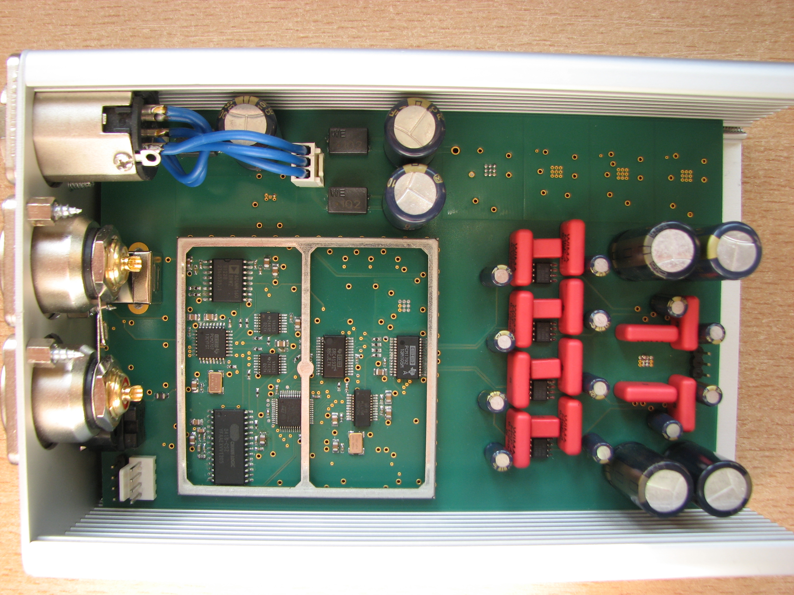

---
# Introduction

Nowadays, there is a strong tendency to minimize the time required to design electronic devices, because the company that brings its product to market first is able to achieve significant revenue, which decreases as competition appears. For this reason, companies strive to optimize their products so that they are more energy-efficient, more powerful, and offer more features. All these efforts aim to attract as many users as possible and thus maximize profits.

Hardware designers face an increasingly difficult task—they must design equipment in ever shorter timeframes while continuously increasing its level of complexity. Computer programs that enable circuit simulation are extremely helpful here, as they significantly reduce the time needed to design the appropriate system. Although such software is expensive for individual users, companies readily invest in it.

Despite their advantages, computer simulations also have disadvantages—no model ever behaves exactly the same as a physical device. It is relatively easy to model a small circuit, but for very complex devices, individual blocks are modeled separately without knowing how they will influence each other. Therefore, after designing a PCB, it must be properly tested, both in terms of electromagnetic interference and heat dissipation—which is becoming an increasingly important issue as electronic components continue to shrink.

Once we have a finished device, it is worth checking whether using cheaper components or removing some of them would significantly affect the system’s parameters—such tests are not very complicated, and they can save substantial amounts of money, especially when the device is to be produced on a large scale. A special category of equipment includes measurement devices, low-noise devices, and all systems that operate with very low-level signals.

Designing such equipment requires extensive experience and knowledge, and it is easy to overdo certain design decisions. Low-noise components are much more expensive, and using them everywhere possible significantly increases the cost. On the other hand, even a single component with poor parameters (e.g., high resistance) can noticeably affect the noise level of the device. The designer therefore faces a difficult task—creating equipment that uses the smallest number of expensive components while maintaining high performance. For this reason, it is worthwhile to examine the built device with respect to optimization.

If components are found whose removal does not significantly affect the device’s behavior, one must calculate whether it is worthwhile to redesign the PCB or whether production should begin as soon as possible. It is also important to consider the fact that reconfiguring a production line also generates additional costs.

This work addresses the problem of designing and programming a sound card as well as optimizing it in terms of the number of components used.

---

# Purpose of the Work

The aim of this project is to design and build a stereophonic sound card and to examine the influence of selected power-supply components on the noise level of the card. To accomplish this task, the following functions were defined for the designed device:

- high sound quality: max –120 dB THD+N

- circuits improving audio quality

- possibility of use with a computer

- ability to connect to a CD player and home-theater system

- standard connectors enabling connection to headphones as well as an amplifier

- aluminum enclosure

- configuration interface

In order to meet the design assumptions listed above, it was necessary to address the following issues:

- Become familiar with the architecture of sound cards

- Select an appropriate enclosure

- Choose suitable components and test all integrated circuits

- Design the sound card and assemble it

- Write the control software for the card

- Design the outline and mounting-hole pattern for the aluminum enclosure

- Measure the noise level at the card’s output and examine the influence of selected power-supply components

A solution was developed based on a 4-layer PCB with dimensions of 99 × 150 mm, adapted to the Hammond enclosure (160 × 53 × 103 mm). The chosen connectors for digital interfaces were TOSLINK and USB, while the analog connectors included 2× RCA and a 6.35 mm (¼″) jack. The connector selection dictated the choice of integrated circuits. To fully utilize the potential of the 24-bit converter, a resampler was used to convert audio from 16-bit/44.1 kHz to 24-bit/192 kHz, since most music is available in the former format.

The project was divided into four stages. First, all integrated circuits had to be tested. In the second stage, the PCB was designed and electrical connections were verified. In the third stage, software for the microcontroller managing the card was written. UART was chosen as the configuration interface due to its simplicity as well as the possibility of communication with a computer. Additionally, it was assumed that in the future, the card would be equipped with an OLED display and a dedicated controller board—which further supports the advantages of the chosen interface.

In the fourth stage, the noise parameters of the device were measured, along with the impact of selected power-supply components.

---
# Sound Card Design

Figure 1a shows the block diagram of the designed sound card.
The card features two inputs: USB and TOSLINK. The USB interface operates in device mode, which means it cannot play music from a flash drive but can only receive audio from a computer. The optical TOSLINK connector carries audio in the SPDIF format.

A USB isolator provides galvanic isolation between the grounds of the computer and the sound card, preventing noise from the computer from coupling into the audio circuitry. Both converters — SPDIF-to-I2S and USB-to-I2S — translate the incoming digital audio stream into a PCM signal transmitted via the I2S interface, which is the standard method of transferring audio data between processing components.

A multiplexer is used to select the audio source. The resampler block processes the incoming samples and supports both sampling-rate and bit-depth conversion. The processed samples are then forwarded to the DAC, which converts them into an analog signal.

The clock generator provides low-jitter square-wave signals for both the resampler and the DAC. Because the DAC outputs a current signal, a current-to-voltage converter is used to transform it into a voltage output. A headphone amplifier is included to provide sufficient current drive for headphones.

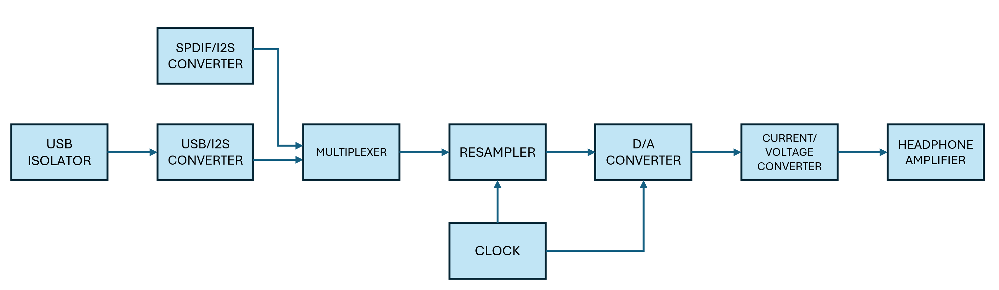

*Figure 1a: Block diagram of the designed sound card*

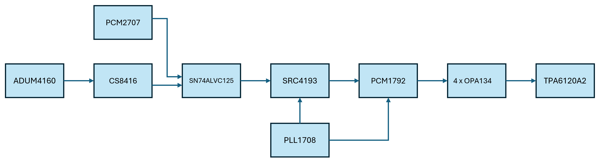

*Figure 1b: Block diagram of the designed sound card*

Before selecting the integrated circuits, I reviewed several articles on the construction of:

- CD players (e.g., Ayona Audio CD1sc)

- Sound cards (ASUS Xonar Essence ST)

- External DACs (Slyleaudio Carat-Topaz)

I also gathered additional insights on DAC design from online discussions and technical resources. After analyzing these materials, I decided to use the PCM1792 DAC because it is widely popular both among DIY sound card builders and in professional audio equipment. The PCM2707 chip is one of the few ICs that convert USB to I2S and was selected despite being 16-bit. For ground loop isolation, I used the ADUM4160, as it was the only USB isolator readily available in Poland.

To increase the versatility of the card, I decided to add an optical input, allowing the device to connect, for example, to a home theater system. Among SPDIF-to-I2S converters, the most popular are CS8416 and DIR9001. I chose the CS8416 due to its wider supported frequency range (32 kHz–192 kHz). After reviewing the datasheets for the PCM2707 and CS8416, I found that neither provides tri-state outputs. Therefore, a multiplexer was required, which I implemented using two SN74ALVC125 ICs.

To reduce jitter, I employed a precise clock generator composed of a FOX924B (27 MHz) crystal oscillator and a PLL1708 IC. Since this clock arrangement could not be used directly, I incorporated an asynchronous sample rate converter (SRC4193), which not only resamples the audio but also synchronizes the clock signal from the PLL1708 with the signals on the I2S bus.

For the headphone amplifier, I used the widely adopted TPA6120A2. The analog section of the amplifier was built according to the reference schematic in the datasheet, which uses the OPA4134 op-amp.

When selecting components, I primarily focused on offerings from Texas Instruments, as they provide free samples. Consequently, most of the ICs used in this design are from TI.

---
## USB isolator

The IC requires a power supply on both the computer side and the card side. USB_VOLTAGE is 5 V, while the voltage on the card side is adjusted to match the other components and is 3.3 V. Inside the ADUM4160, there is a 3.3 V voltage regulator that supplies power to the IC on the computer side – this output is labeled VDD1.

The PDEN pin, when connected to ground, is used for measuring the IC’s impedance; during normal operation, it should be connected to a positive voltage. The SPU and SPD pins are used to select the operating speed of the IC: when a pin is connected to ground, the USB Low Speed mode (1.5 Mb/s) is selected; otherwise, USB Full Speed mode (12 Mb/s) is selected. It is important that the SPU and SPD pins are in the same state on both sides of the IC. As shown in the figure, the selected mode is USB Full Speed.

Resistors R1 and R2 are used to suppress interference. The line ADUM4160_PIN can be used to enable or disable the device’s visibility to the computer.

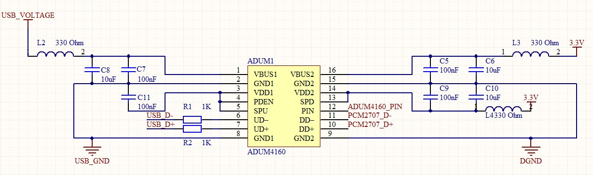

*Figure 2 shows the schematic of the ADUM4160 IC used as a USB isolator.*

---
## USB/I2S converter

Figure 3 shows the schematic of the USB/I2S converter.
It is based on the PCM2707 IC, which supports audio transmission in three formats:

- 16-bit, 32 kHz

- 16-bit, 44.1 kHz

- 16-bit, 48 kHz

As can be seen, the resolution is limited to 16 bits. Despite this, the PCM2707 was chosen because 24-bit ICs are difficult to obtain. The PCM2707 includes a USB/I2S converter, a USB/SPDIF converter, and a built-in DAC, allowing music to be played directly through headphones. The type of converter is selected by connecting the FSEL pin to ground (I2S mode) or to 3.3 V (SPDIF mode).

The IC requires an external 12 MHz crystal oscillator, which is connected to the XTI pin. The PCM2707 D+ and D- lines are connected to the ADUM4160 isolator. The D+ line must not be pulled up to the supply voltage when the IC is disconnected from the computer; this is achieved using transistor Q1. The HOST pin is used to detect computer connection. For this purpose, an optocoupler is used, as shown in Figure 4.

The lines PCM2707_CS, MCLK1, and MOSI1 are connected to the SPI1 bus, which enables functions such as:

- increasing/decreasing volume

- skipping to the next/previous track

- pausing/resuming playback

- changing the device name displayed on the computer

The IC powers up and operates automatically, so in this work the SPI bus was not used; however, it is connected to the PCM2707 for potential future applications.

The analog section, which allows direct listening while operating in USB/I2S mode, does not require additional power, so pins 26–29 are not connected. The lines PCM2707_LRCK, PCM2707_BCK, and PCM2707_SDOUT are part of the I2S bus. The SYSTEM CLOCK signal is not routed externally because the card has its own clock generator.

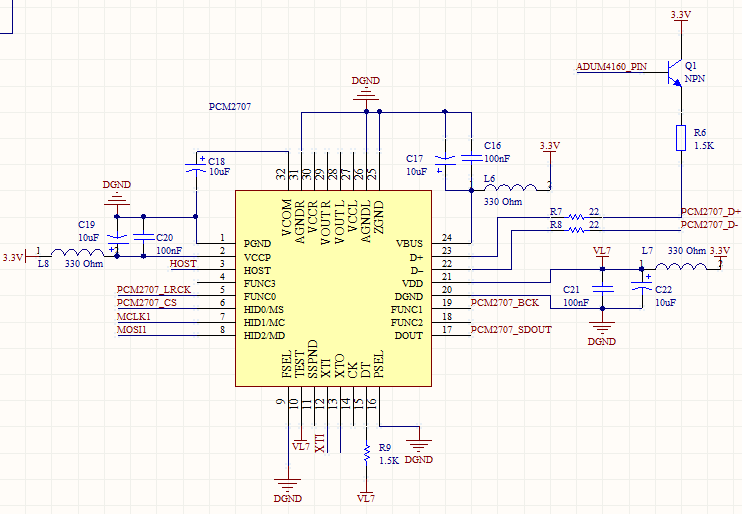

*Figure 3: USB/I2S converter schematic.*

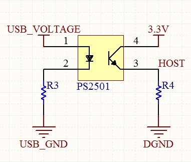

*Figure 4: Host detection circuit schematic.*

---
## SPDIF/I2S converter

Figure 5 shows the schematic of the SPDIF/I2S converter.
For this purpose, the widely used CS8416 IC was employed, which can process signals with the following parameters:

Resolution up to 24 bits

Sampling frequency from 32 kHz to 192 kHz

To receive the SPDIF signal, an optical receiver TORX147 was used. Although the CS8416 has eight multiplexed inputs, only one – RXP0 – was used, which is the default input after a reset. Capacitors C43 and C45, together with resistor R11, form a filter used by the internal PLL loop.

The CS8416 can operate in two modes: hardware mode and software mode.

- In hardware mode, the IC can be controlled without a processor.

- In software mode, two interfaces are available for control: I²C or SPI.

To operate the IC in software mode, a 47 kΩ resistor must be connected to the SDOUT line and pulled up to 3.3 V. The component is controlled via the SPI bus, with selection performed by changing the CS8416_CS line from high to low.

The I2S output is available on the lines:

- CS8416_LRCK

- CS8416_BCK

- CS8416_SDOUT

Upon power-up, the IC is in low-power mode. To activate it, the RUN bit in register 0x04 must be set. By default, the CS8416_BCK and CS8416_LRCK lines are configured as inputs; to change this, the SOMS bit in register 0x05 must be set.

The default I2S bus format is left-justified, whereas the rest of the components on the card operate in standard I2S mode. This must be adjusted by setting the SODEL and SOLRPOL bits in register 0x05.

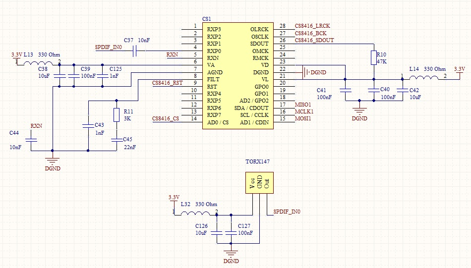

*Figure 5: SPDIF/I2S converter schematic.*

---
## Multiplexer

The multiplexer is built using two SN74ALVC125 tri-state buffers, as shown in Figure 6. The input signals are: PCM2707_LRCK, PCM2707_BCK, PCM2707_SDOUT, and CS8416_LRCK, CS8416_BCK, CS8416_SDOUT. These signals pass through resistors to suppress possible spikes and reduce signal oscillations.

The output signals are: SRC4193_SDIN, SRC4193_BCKI, SRC4193_LRCKI.

The control signals are: PCM_SDOUT_EN, PCM_LRCK_EN, PCM_BCK_EN, and CS_SDOUT_EN, CS_LRCK_EN, CS_BCK_EN.

The multiplexer operates as follows: to select the I2S interface from the PCM2707 IC, the control lines PCM_SDOUT_EN, PCM_LRCK_EN, and PCM_BCK_EN must be set low, while the lines CS_SDOUT_EN, CS_LRCK_EN, and CS_BCK_EN must be set high.

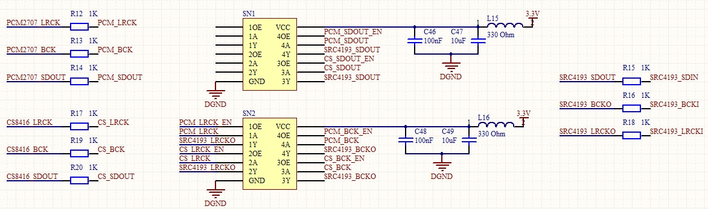

*Figure 6: Multiplexer schematic.*

---
## Generator

The audio signal generator schematic is shown in Figure 7.
For this purpose, the PLL1708 IC was used. The IC requires a 27 MHz clock signal for proper operation, which is provided by the FOX924B crystal oscillator. This oscillator is highly precise, with a frequency tolerance of ±1.5 PPM at 25 °C.

An additional advantage of using crystal oscillators instead of resonators is that there is no need to worry about the capacitance of the trace supplying the clock to the IC, provided that the frequency and trace length are small.

The IC has three programmable outputs: SCK1, SCK2, and SCK3. The frequency on the SCK0 output is fixed at 33.8688 MHz. The MCKO1 and MCKO2 outputs are also non-configurable, each providing a 27 MHz signal.

The IC is controlled via the SPI interface (lines PLL1708_CS, MOSI2, MISO2).

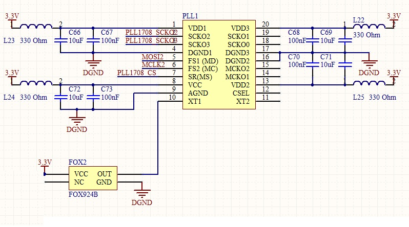

*Figure 7: Audio clock generator schematic.*

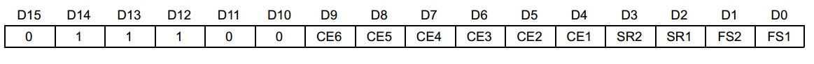
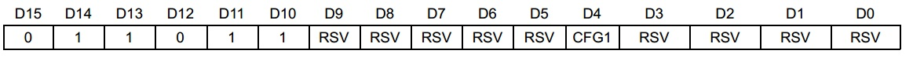

*Figure 8: Configuration registers of the PLL1708 IC.*

The CE6–CE1 bits are responsible for enabling the corresponding outputs. For the purposes of this sound card, only the SCKO2 and SCKO3 outputs are used. The remaining outputs should be left disabled, as their pins act like antennas and can generate interference.

Table 1 shows the output frequency fs depending on the settings of the FS[1:0] and SR[1:0] bits. For example, selecting FS[1:0] = "00" and SR[1:0] = "01" results in an fs frequency of 96 kHz. Consequently, depending on the configuration, the available fs frequencies are listed in Table 3.

The signals on the SCKO2 and SCKO3 outputs are 256 fs and 384 fs, respectively.

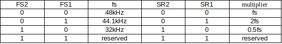

*Table 1: Output signal settings depending on the FS[1:0] and SR[1:0] bits.*

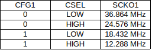

*Table 2: SCKO1 output signal depending on the CFGR bit and CSEL line settings.*

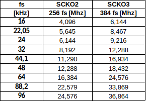

*Table 3: Clock signals on the SCKO2 and SCKO3 outputs.*

---
## Resampler

Figure 9 shows the resampler schematic.
For this purpose, the SRC4193 IC was used. The input signals SRC4193_SDIN, SRC4193_BCKI, and SRC4193_LRCKI come from the multiplexer, while the SRC4193_RCKI signal is provided by the clock generator. The output signals are SRC4193_BCKO, SRC4193_LRCKO, and SRC4193_SDOUT.

The IC is controlled via the SPI bus (lines: MOSI2, MCLK2, and SRC4193_CS). The SRC4193_BYPAS line allows bypassing the resampler, passing the input samples directly to the output. The SRC4193_RATIO line informs an external circuit whether the input signal frequency is higher than the output signal frequency. The SRC4193_RDY line notifies the processor about the validity of the output samples.

Additionally, the IC has a very important feature that significantly improves audio quality: the RCKI signal does not need to be in phase with the input signals on the I2S bus, while the output signals on the I2S bus are synchronized with the RCKI clock. This functionality allows the use of a separate clock for the DAC and the resampler, improving overall timing and audio fidelity.

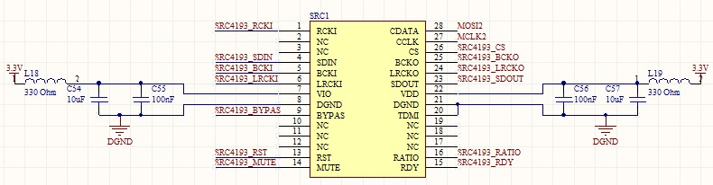

*Figure 9: Resampler schematic.*

In Figure 10, the register map of the resampler is shown. Setting the PDN bit enables the operation of the resampler. Setting the TRACK bit causes the attenuation for the left channel to also apply to the right channel. Otherwise, both channels must be configured separately. The MUTE and BYPAS bits are available both via the SPI bus and through the pins—they perform the same functions. The MODE[2:0] bits determine the output signal speed and the operating mode (MASTER / SLAVE) of the I2S input and output ports. In the card design, the output port operates in MASTER mode, while the input port operates in SLAVE mode.

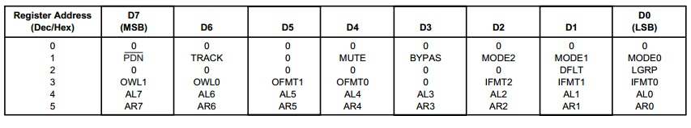

*Figure 10: Register map of the SRC4193.*

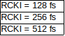

*Table 4: Resampler speed modes depending on the RCKI signal.*

Table 4 presents the output signal speed modes (fs) on the I2S bus depending on the RCKI signal frequency. As mentioned earlier, the speed is selected using the MODE[2:0] bits. The DFLT bit determines whether the resampled signal is passed through the filters. Setting the LGRP bit reduces the delay between the input and output of the device from 64 to 32 samples. The OWL[1:0] bits define the output word length of the SRC4193—for example, it is possible to upsample a 16-bit signal to 24 bits.

Table 6 shows the relationship between the output data format and the OFMT[1:0] bit settings. For the purposes of the card, the I2S output format was chosen, since the default format of the D/A converter is 24-bit I2S.

The SRC4193 requires specifying the input data format, which is done using the IFMT[2:0] bits, as shown in Table 7. The default format of the PCM2707 is I2S, and the CS8416 has been configured, as mentioned earlier, to output I2S. Therefore, the SRC4193 must be configured to accept a 24-bit I2S signal at its input.

It should be noted that a 24-bit I2S bus, unlike Right-Justified format, does not need to know the exact size of the input data—for example, the data may be 5, 16, or 24 bits.

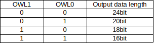

*Table 5: Output data length of the SRC4193 depending on the OWL[1:0] bit settings.*

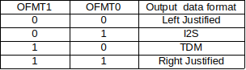

*Table 6: Output data format of the SRC4193 depending on the OFMT[1:0] bit settings.*

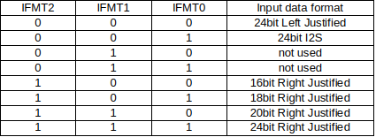

*Table 7: Input data format of the SRC4193 depending on the IFMT[2:0] bit settings.*

Using the AL[7:0] and AR[7:0] bits, the attenuation is set according to the following formula:

Output attenuation (dB) = (–N × 0.5)

where N is the value stored in AL[7:0] or AR[7:0].
Thus, the attenuation can be adjusted in the range from 0 dB to –127.5 dB.

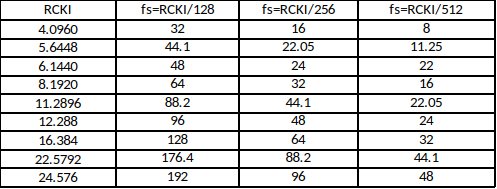

*Table 8: Relationship between the output signal fs [kHz] of the SRC4193 and the RCKI frequency [kHz].*

**Table 8 is very important because it summarizes all operating modes of the resampler.**

**All possible frequencies generated by the PLL1708 (SCKO2) are shown in the table as RCKI. From the table, it is clear that the best solution is to configure the resampler so that the output frequency falls within the range 32 kHz – 192 kHz (fs = RCKI / 128).**

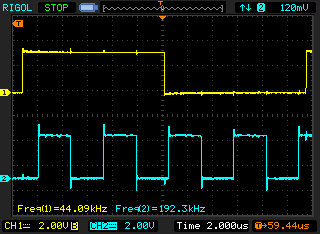

*Figure 11: LRCK signal before the resampler (yellow) and at the output (blue).*

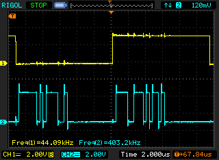

*Figure 12: LRCK (yellow) and DATA signals at the input of the resampler.*

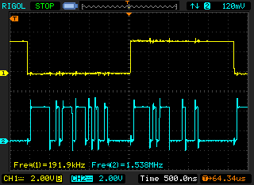

*Figure 13: LRCK (yellow) and DATA signals at the output of the resampler.*

Figures 11–13 show the signals on the I2S buses. The input signal to the resampler has parameters: 16 bit / 44.1 kHz, while the output PCM signal is 24 bit / 192 kHz.

In Figure 11, a comparison of the two LRCK signals is shown — before the resampler (yellow) and after the resampler. In Figures 12 and 13, the blue signals represent the data word length — it can be seen that the input signal (Figure 12) is 16 bits, while the output signal (Figure 13) is 24 bits.

---
## Digital-to-Analog Converter (DAC)

The DAC used is the PCM1792. This chip features a 24-bit resolution and a maximum sampling rate of 192 kHz. The maximum dynamic range is 127 dB (2 V RMS).

The input signals come from the resampler (PCM1792_LRCK, PCM1792_DATA, PCM1792_BCK) and from the generator (PCM1792_SCK). The chip, like the others, is controlled via the SPI bus; however, for the purposes of this thesis, it is not configured because the default settings allow optimal operation.

The ZEROL and ZEROR lines are used for zero detection in both channels. These lines are not required for correct operation of the device but have been connected to the processor as a precaution in case they are needed in the future.

The DAC has four current outputs, two for the right channel and two for the left channel. The maximum current output for each output is 7.8 mA p-p.

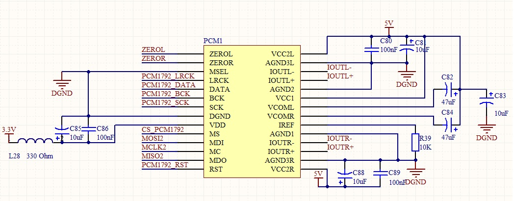

Figure 14: Electrical connection diagram of the DAC.

---
## Current-to-Voltage Converter and Headphone Amplifier

The schematic of the current-to-voltage converter and headphone amplifier shown in Figure 15 was taken from the datasheet of the TPA6120. The only modifications I made were replacing the OPA4134 with four OPA134 operational amplifiers and increasing the voltage from ±5 V to ±12 V.

Replacing the amplifiers made PCB trace routing easier, while the voltage change was necessary for the proper operation of the board — there is an error in the datasheet that prevented the board from playing music correctly.

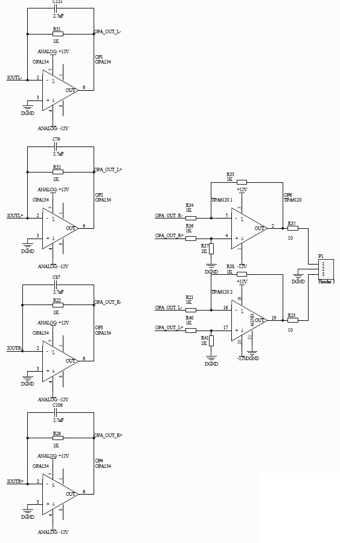

*Figure 15: Electrical connection diagram of the current-to-voltage converter and headphone amplifier.*

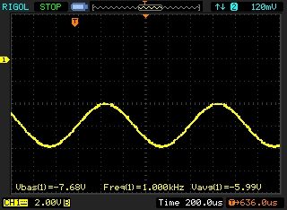

*Figure 16: Signal at the output of the current-to-voltage converter when a 1 kHz sine wave is played.*

As mentioned earlier, the maximum current from each output is 7.8 mA. Multiplying this value by the resistance in the current-to-voltage converter (1 kΩ) gives the maximum output voltage, which is 7.8 V.

As can be seen in Figure 16, the "maximum" output voltage is –7.68 V, which is approximately equal to –7.8 V. It is clear that with a ±5 V symmetric power supply, the output signal would be severely distorted.

The 2.7 nF capacitor together with the 1 kΩ resistor forms a low-pass filter with a cutoff frequency of 59 kHz.

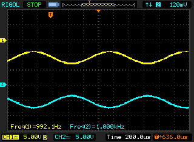

*Figure 17: Left channel at the output of the current-to-voltage converters.*

The popular TPA6120A2 chip was used as the headphone amplifier. The device was used as a differential amplifier, with all resistors having the same value (1 kΩ). The output voltage depends on the input voltages according to the following formulas:

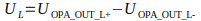
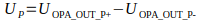

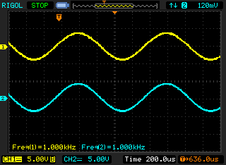

*Figure 18: Signals at the output of the sound card.*

Figure 18 presents the audio signals at the sound card output when the played sound is a sine function with a frequency of 1 kHz.

---
## Processor

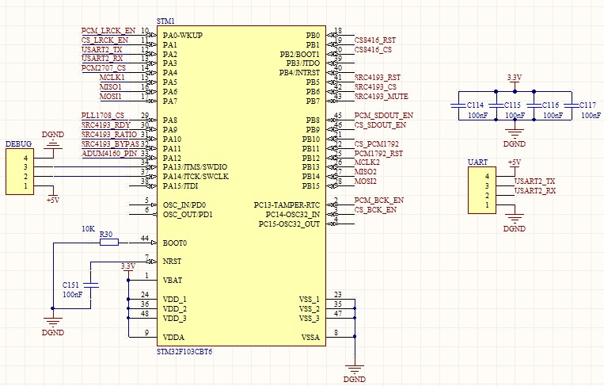

*Figure 19: Electrical connection diagram of the processor controlling the card*

The board is controlled by a Cortex-M3 STM32F103CBT6 processor. This chip has the following features:

- Core frequency: 72 MHz

- RAM: 20 kB

- FLASH: 128 kB

- Peripherals: USB, CAN, 3×UART, 2×I2C, 2×SPI, ADC

- Debug interfaces: JTAG, SWD

- Package: LQFP48

The SPI1 bus is used to control the CS8416 and PCM2707, while the SPI2 bus controls the PLL1708, SRC4193, and PCM1792. Using two SPI buses made PCB trace routing easier.

The UART interface has been brought out for future use — it will handle communication with the processor controlling the display and the configuration of the board. The processor is programmed via the SWD interface, which requires only two wires plus ground.

---
## Power Supply

**Digital Section Power Supply**

For powering the digital section, TPS79333 regulators were selected. This device features low noise (approximately 32 µV in the 200 Hz–100 kHz band), a current capacity of up to 200 mA, and an output voltage of 3.3 V. An additional advantage of this regulator is its SOT23 package.

The LC filter at the regulator output is used to remove noise that the regulator itself could not eliminate. In this design, a separate regulator was used for each digital device — a total of 11 units.

Figure 21 shows the filter used for all power inputs of each device in the digital section. The ferrite bead is intended to suppress frequencies above 100 MHz, preventing relatively long PCB traces from radiating interference.

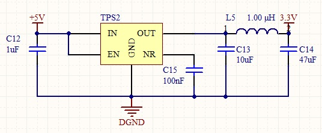

*Figure 20: Electrical connection diagram of the TPS79333 voltage regulator and LC filter.*

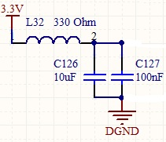

*Figure 21: Filter used for each power input in the digital section.*

**Analog Section Power Supply**

The symmetric power supply for the analog section should be within the range ±13.35 V. The lower limit of this range is determined by the minimum required dropout voltage of the regulators (1 V), while the upper limit is set by the maximum voltage rating of the capacitors.

Figure 22 shows the input power filter. Common-mode chokes and low-ESR capacitors were used for this purpose.

Figure 23 shows a pair of regulators used to power the current-to-voltage converters; a second identical pair is used to power the headphone amplifier.

The TPS7A47 regulator features an input voltage range from +3 V to +36 V, a 1 A output current, and ultra-low noise of only 4.17 µV RMS in the 10 Hz–100 kHz band.

The TPS7A3301 regulator features an input voltage range from –3 V to –36 V, a 1 A output current, and very low noise of 16 µV RMS in the 10 Hz–100 kHz band.

Additionally, decoupling capacitors were used for each operational amplifier, consisting of 10 µF Panasonic FC electrolytic capacitors and 100 nF Wima polypropylene capacitors.

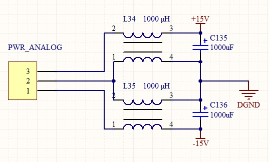

*Figure 22: Input power filter for the analog section.*

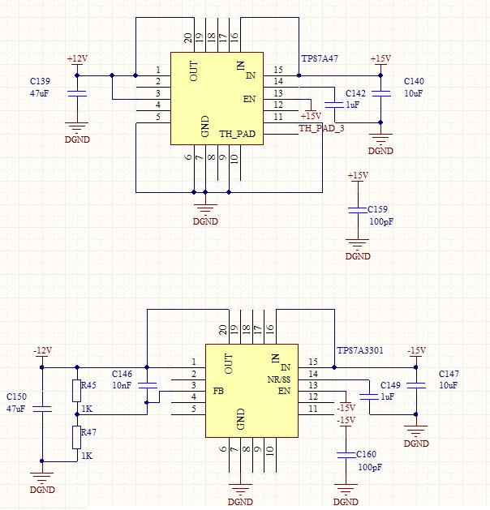

*Figure 23: Electrical connection diagram of the regulators in the analog section.*

---
## Sound Card Design

Since the sound card was intended to have very high noise performance (S/N > 110 dB), the design was implemented on a 4-layer PCB, with dimensions tailored to fit a Hammond aluminum enclosure.

The PCB design process began by placing the most critical components, followed by routing the traces between them. Next, the power supply circuits were positioned and the power traces were distributed. The inner layers contain power and ground planes. The digital and analog grounds are routed so that they meet at only one point — beneath the DAC.

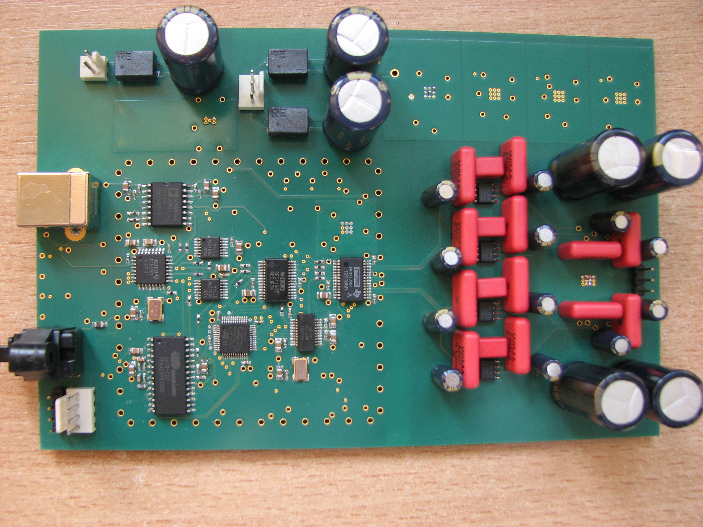
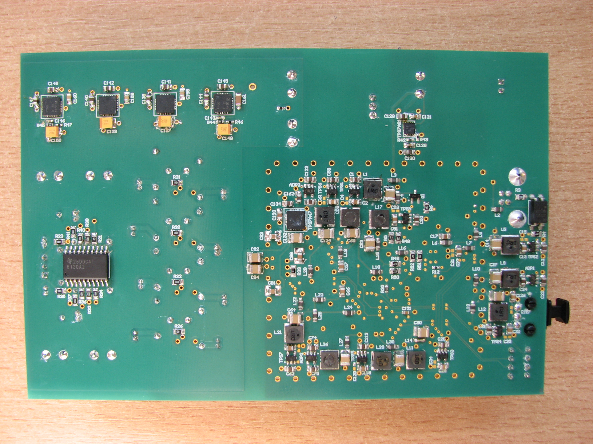

*Figure 24: Sound card built for the purposes of the master's thesis.*

---
## Sound Card Control Program

First, the PLL circuits are configured so that the processor clock frequency is 24 MHz, even though it can operate at up to 64 MHz using the internal oscillator. Next, the clocks for the relevant peripherals are enabled: GPIOA, GPIOB, GPIOC, USART2, SPI1, and SPI2. Each used pin must be configured as an input, output, or an alternate function if the pin is used by a bus.

During the configuration of the SPI buses, the following settings are applied: most significant bit first, 8-bit data length, clock polarity 0, clock phase 1 (data is transmitted on the rising edge), and full-duplex communication.

The UART bus is used to configure the board via a computer, but in the future, it will be used by an additional display board, allowing the user to control functions such as volume. UART configuration involves setting the baud rate (9600 b/s), data field length (1 byte), and interrupt priority, as interrupts will be used for data reception.

Next, the PLL1708 is initialized by releasing the RESET line and generating at least 1024 clock pulses on the MCLK line. The generator’s default frequency is set to 64 kHz to achieve the lowest possible jitter (≈44 ps) at the SCKO3 output, which is directly connected to the DAC.

The resampler is initialized by releasing the RESET line for more than 500 ns, during which the PLL1708 provides the RCKI signal to the SRC4193. The resampler’s default settings are 24 bit / 128 kHz, with 0 dB attenuation — this is the signal delivered to the DAC.

To use the SPDIF interface, the CS8416 must be configured — it is set to I2S mode (default mode is Left Justified) and normal operation is enabled.

After selecting the default interface (USB), the program waits for control commands via UART. Incoming data is parsed, and the corresponding function is executed.

Available functions:

- Source selection: SPDIF or USB

- Sampling frequency selection: 32, 44.1, 48, 64, 88.2, 96, 128, 176.4, 192 [kHz]

- Resolution selection: 16, 18, 20, 24 [bit]

- Volume setting: from –127.5 dB to 0 dB in 0.5 dB steps

Example commands:

- *SET_RES_20# — sets the resampler to generate 20-bit samples

- *SET_FREQ_192# — sets the resampler to output at 192 kHz

- *SELECT_SPDIF# — selects SPDIF as the audio source

- *SET_VOL:-30# — sets the attenuation to –30 dB

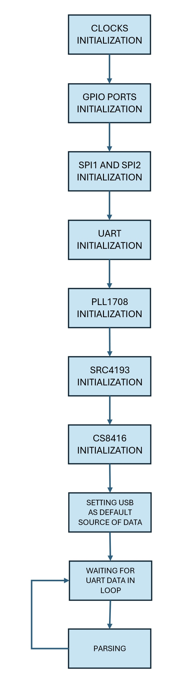

*Figure 25: Block diagram of the program controlling the sound card.*

---
## Impact of power supply elements on the sound card noise

To investigate the influence of power supply components on the card’s noise and to enable comparison with devices from other manufacturers, it was necessary to refer to the Polish Standard PN-EN 61606-2: “Sound and audiovisual equipment — Digital audio chains — Basic measurement methods for audio parameters — Part 2: Consumer applications”. Measurements were carried out using the AP2700 device. Since it does not have a USB output, the measurements were performed only via the optical interface.

The noise parameters measured were S/N ratio (Signal-to-Noise) and THD+N (Total Harmonic Distortion + Noise). The S/N measurements were conducted by first measuring the output voltage of the card at 0 dBFS, followed by measuring the noise level in the 22 Hz–22 kHz band after applying a digital zero signal. The S/N ratio alone does not provide a definitive indication of whether the device has an appropriate noise level. Some manufacturers, aiming to artificially increase this parameter, design additional circuits that short the DAC output to ground when a digital zero is applied.

For this reason, the THD+N parameter was also measured. An additional advantage of this parameter is that it is reported by most manufacturers, making it possible to compare this design with other sound cards. The THD+N measurement was performed by setting a digital signal of –60 dBFS on the generator and measuring the resulting noise (and harmonics) in the 22 Hz–22 kHz band. For both parameters, a 997 Hz sine wave (24 bit, 48 kHz) was used.

**Power transformers**

In some high-end audio equipment, it can be observed that two separate transformers are used — one for the digital section and another for the analog section. Transformers are among the more expensive components, so it is worth assessing whether using two separate units is justified.

Tables 9 and 10 show the S/N and THD+N values depending on different resampler operating modes. The difference between the tables is that Table 9 presents data when the card was powered by two transformers, while Table 10 shows data when the card was powered by a single transformer.

When the card was powered by two sources, the S/N ratio (for a resampler frequency of 64 kHz) increased by only 1 dB. Additionally, for a frequency of 96 kHz, the THD+N parameter decreased by 1 dB. Based on these tables, it can be concluded that using two transformers is not particularly meaningful, as their impact on the designed sound card is minimal and completely inaudible.

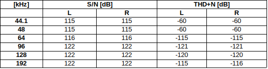

*Table 9: Sound card parameters when the digital and analog sections were powered by two separate transformers.*

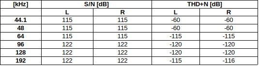

*Table 10: Sound card parameters when the digital and analog sections were powered by a single transformer.*

**Voltage regulators**

Table 11 shows the noise levels when the current-to-voltage converter and headphone amplifier were powered by only two standard regulators, namely LM317 and LM337, with a total cost of about 3 PLN. Measurements were performed on a single channel, as the other channel exhibits nearly identical characteristics. In Table 11, question marks indicate that the measurement is subject to a significant error, as the instrument behaved unstably during the reading. This is likely due to high-frequency (>100 kHz) noise from the power supply affecting the measurements.

Comparing Tables 10 and 11 (excluding the values marked with question marks), it can be concluded that using ultra-low-noise regulators in this case is unnecessary, as the noise parameters remain almost identical while the cost increases drastically.

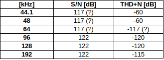

*Table 11: Sound card parameters when the power supply was regulated using standard regulators: LM317 and LM337.*

---
## Frequency response measurement

Although the frequency response measurement is not considered a noise parameter, it is still worthwhile to perform it to verify whether the card is operating correctly. Figure 26 shows the frequency response. It can be observed that in the 20 Hz–20 kHz band there is a significant voltage drop (0.7–0.8 dBu).

It turned out that the recommended capacitor value (2.7 nF) for the current-to-voltage converter was not available, and an alternative value (3.3 nF) was ordered. Figure 27 presents the frequency response measurement after the capacitors were removed from the current-to-voltage converter, confirming that the problem was caused by an incorrectly selected component. In this case, the amplitude change in the 20 Hz–20 kHz band was only 0.1 dBu.

After analyzing the measurements and simulations in PSPICE, it was decided to use a capacitor with a value of 2.2 nF.

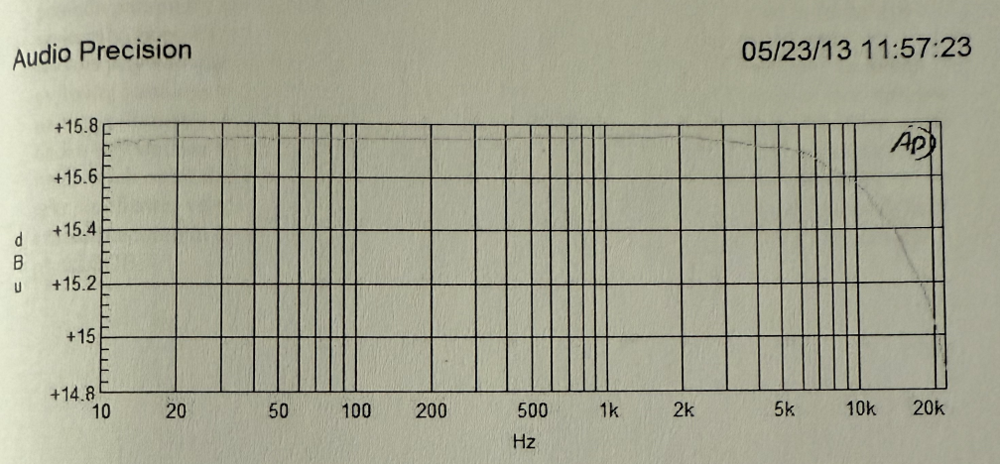

*Figure 26: Frequency response of the sound card with 3.3 nF capacitors used in the current-to-voltage converter.*

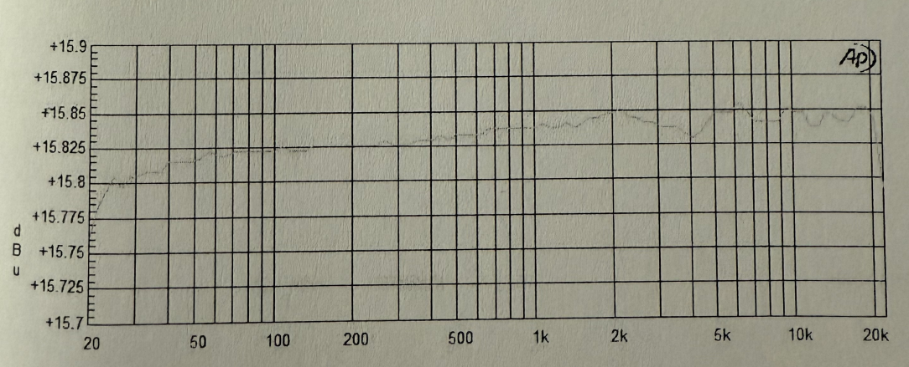

*Figure 27: Frequency response of the sound card with the capacitors removed from the current-to-voltage converter.*

---
# Conclusion

The aim of this thesis was to design and construct a stereophonic sound card and to investigate the influence of selected power-supply components on the noise performance of the device. In this work, the main emphasis was placed on the correct execution of the design process, as the available resources were limited. For this reason, after selecting all integrated circuits, it was necessary to test them individually on separate prototype boards, which significantly extended the overall design time. The waiting time for the PCB (approximately three weeks) as well as for new samples (two weeks), ordered after damaging several voltage regulators during testing, also contributed to project delays. Despite these difficulties, the project objective and design assumptions were fully achieved.

An analysis of the measurement results shows that the designed sound card offers performance comparable to some of the best commercially available devices. The investigation further demonstrated that, in low-noise circuit design, the use of ultra-low-noise voltage regulators and separate transformers for the digital and analog sections is not always justified, as it may significantly increase the cost of the device without improving its performance.

Despite the tests carried out, the device would need to undergo further measurements to become competitive with commercial audio interfaces. In particular, it would be necessary to evaluate the influence of the voltage regulators and the applied LC filters in the digital section on the overall noise performance—tests which were not performed due to time limitations. A possible next step could also involve reducing the size of the enclosure, and consequently the PCB dimensions.

